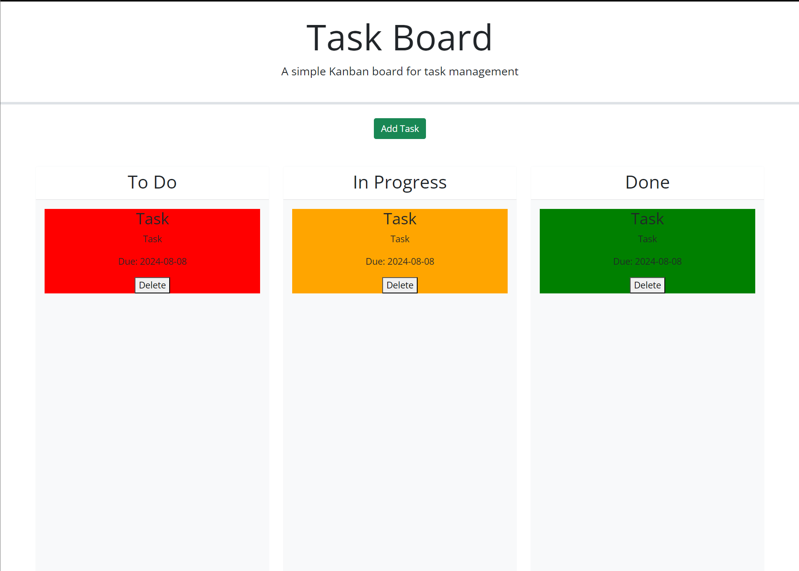

# Kanban Board

## Description

Task Board is a simple Kanban board application designed for efficient task management. The motivation behind this project was to create an intuitive and user-friendly tool that helps individuals and teams organize their tasks visually. This project was built to solve the problem of task overload by providing a clear and organized interface to track tasks through different stages of completion. Throughout this project, I learned about integrating jQuery with Bootstrap for dynamic user interfaces, handling local storage, and managing drag-and-drop functionality with jQuery UI.

## Table of Contents

- [Installation](#installation)
- [Usage](#usage)
- [Credits](#credits)
- [License](#license)
- [Badges](#badges)
- [Features](#features)
- [How to Contribute](#how-to-contribute)
- [Tests](#tests)

## Installation

To get the Task Board project running locally, follow these steps:

1. Clone the repository:
    ```sh
    git clone https://github.com/ogchromebook/kanban-board
    ```

2. Navigate to the project directory:
    ```sh
    cd kanban-board
    ```

3. Open `index.html` in your preferred web browser.

There are no additional dependencies required, as the project uses CDN links for Bootstrap, jQuery, and jQuery UI.

## Usage

To use the Task Board:

1. Open the application in your browser.
2. Click the "Add Task" button to open the modal for task creation.
3. Fill out the task details, including the title, description, and due date.
4. Click "Add Task" to create a new task in the "To Do" lane.
5. Drag and drop tasks between the "To Do," "In Progress," and "Done" lanes to update their status.
6. Use the "Delete" button on each task card to remove tasks that are no longer needed.

## Example Image



## Credits

This project was developed independently, but it utilizes the following third-party resources:

- [Bootstrap](https://getbootstrap.com/) for responsive layout and styling.
- [jQuery](https://jquery.com/) for DOM manipulation.
- [jQuery UI](https://jqueryui.com/) for drag-and-drop functionality.
- [FontAwesome](https://fontawesome.com/) for icons.
- Andru Sanchez My Tutor!

## License

This project is licensed under the MIT License. For more information, please refer to the LICENSE file in the repository.

---

## Badges


## Features

- Add, edit, and delete tasks.
- Drag and drop tasks between different lanes.
- Persistent storage using local storage.
- Responsive design, compatible with all screen sizes.

## How to Contribute

Contributions are welcome! If you would like to contribute to this project, please follow these steps:

1. Fork the repository.
2. Create a new branch (`git checkout -b feature/your-feature`).
3. Commit your changes (`git commit -m 'Add some feature'`).
4. Push to the branch (`git push origin feature/your-feature`).
5. Open a pull request.

## Tests

Currently, there are no formal tests implemented for this project. However, you can manually test the application's features by interacting with the task board, adding tasks, moving them between lanes, and verifying that all functionality works as expected.
